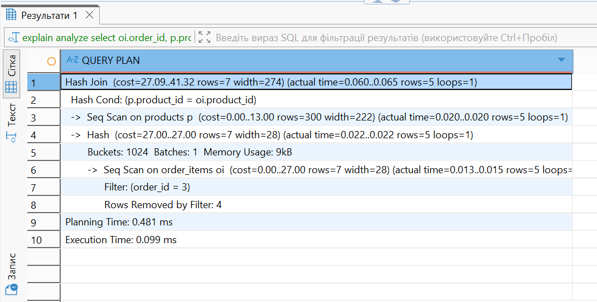

Як ми бачимо на скріншоті, PostgreSQL виконує запит за допомогою Hash Join, об'єднуючи таблиці order_items та products. Для цих двох таблиць використовується Seq Scan, тобто система послідовно переглядає всі рядки цих двох таблиць. Також PostgreSQL використовує Hash.